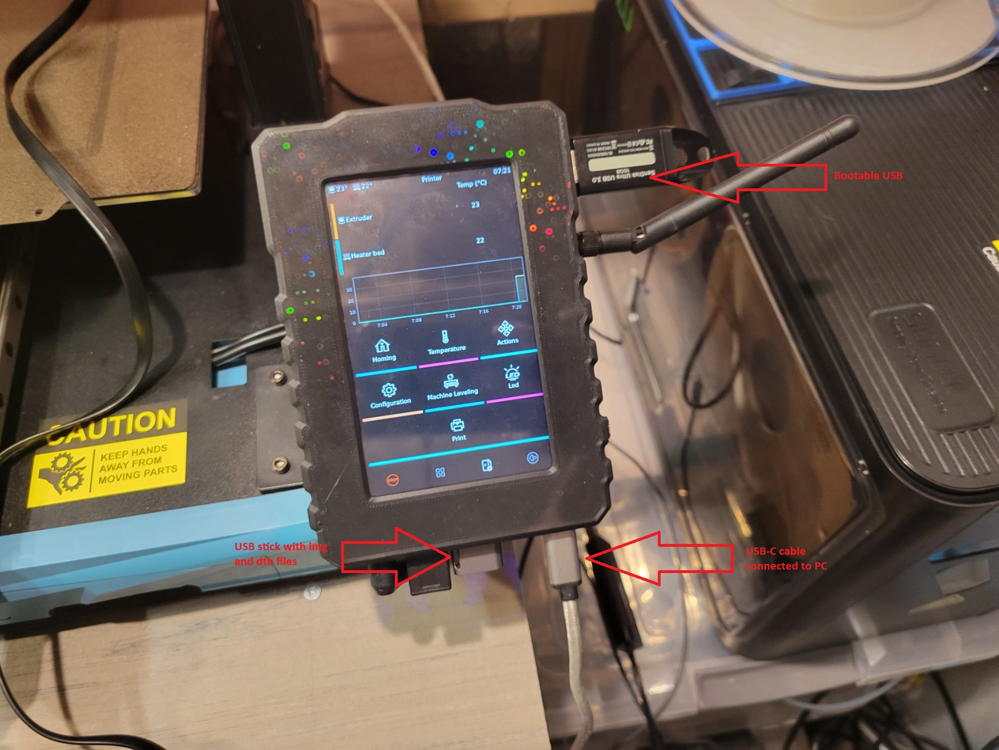
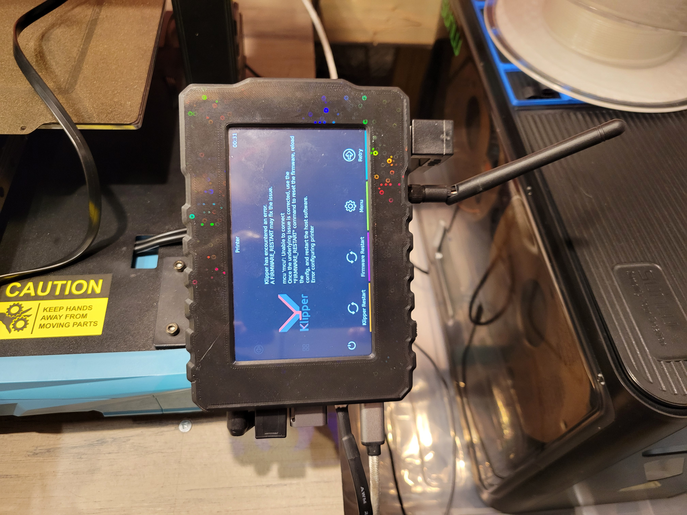
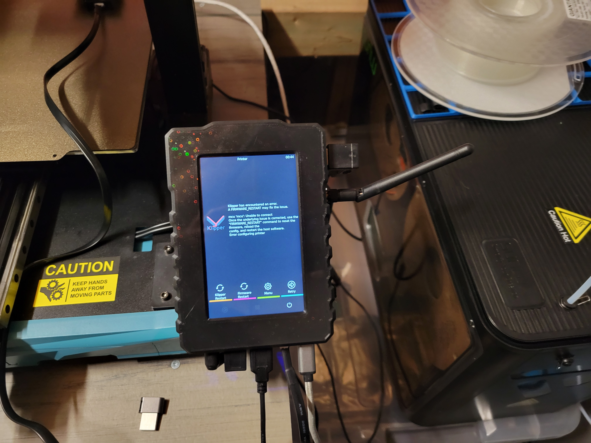

# How to update SV07/SV07+ to Debian Bookworm, flash latest firmware on the MCU and other mods that I use.

Tools and software needed:
1. 2 x 8 gig or more USB Stick (can be done with one USB stick, but this guide assumes 2, as I did it with 2 before I figured I could only use one)
2. Latest release of [unofficial Armbian for MKSPI](https://github.com/redrathnure/armbian-mkspi/releases) (bookworm current or edge)
3. Sovol's compiled dtb directly from their release image (/boot/dtb/rockchip/rk3328-roc-cc.dtb) or use the one I uploaded to [this repository](https://github.com/vasyl83/sv7update/blob/main/rk3328-roc-cc.dtb).
4. Computer (or laptop) with a free USB slot
5. Cable to connect you computer (or laptop) to USB-C port on the klipad, so USB-A to USB-C or USB-C to USB-C

This guide assumes that you have the default Sovol image flashed on the klipad, it doesn't matter what firmware version nor if it boots properly or is in a boot loop.

**Also backup your printer.cfg and any other config files you may need.**

## 1. Preparing USB sticks
Download [Balena Etcher portable and run it](https://etcher.balena.io/#download-etcher)

Click "Flash from file" and select the image you downloaded (I will be using Armbian-unofficial_24.2.0-trunk_Mkspi_bookworm_current_6.6.17.img.xz as example)


Click "Select target" and point it to USB stick


Click Select 1. Then wait for it to finish.

Afterwards extract the .xz file into .img and copy that file to the second USB stick as well as rk3328-roc-cc.dtb

The contents of the second USB should look like this:


## 2. Plugging everyhting into the printer.

Now connect both USBs and your PC into the KliPad.



On you computer Open up Device Manager and expand Ports (COM & LTP). You should see USB-SERIAL CH340 followed by a COM port number (take note ot if, in my case its COM3):


Start up [PuTTY](https://www.chiark.greenend.org.uk/~sgtatham/putty/latest.html)

Input the following settings:
1. Conenction type: Serial
2. Serial line: COM3 (or whatever COM Device Manager shows)
3. Speed: 1500000


Click Open, you should now see a blank black window, press Enter a few times untill you see a login prompt:


Enter the username and password you use (defaults are user:mks password:makerbase)

halt the system:
`sudo halt`

## 3. Booting from USB

Make sure that the KliPad screen in blank, PuTTY window should remain like this (what you see shouldn't be exactly the same, only the result of the command should be the same):


Now simultaniously hold spacebar on your PC and press the power button on the KliPad (the small one on the right side of the screen) for about 10 seconds. Once you release the button you should see text scrolling on PuTTY window, once it stops scrolling, the last line should say `Hit any key to stop autoboot:  0` and you see the cursor adding spaces, release the spacebar, it should look something like this:


Delete all the spaces and type in:
`run bootcmd_usb0`

It will now boot from the USB.


Once the boot is completed you should see on the screen a line `mkspi login: root (automatic login)`


Once it finishes booting you will be prompted to create root password, enter anything. Select your prefered shell (I use zsh), and once it asks you to create a new user, press Ctrl-C to abort and drop into the shell. You are now booted into USB.

## 4. Confirming USB boot

To make sure the system booted from USB type in `lsblk` it will list all the block devices discovered on the KliPad (block devices are basically storage devices). If everything worked properly you should see the following:


sda is our boot USB, as you can see /boot and / are mounted on sda1 and sda2.  

sdb is the second USB containing the img and dtb files.

mmcblk1 is the internal EMMC module.

## 5. Mounting second USB stick

To acces the second USB we need to mount it, first lets create a folder to mount it on.

`mkdir /mnt/temp` - create a folder temp under /mnt

`mount /dev/sdb1 /mnt/temp` - mount the first partition of sdb under /mnt/temp

If you get a hint about fstab being modified, it's normal, don't pay attention to that hint.

`cd /mnt/temp` - change directory to /mnt/temp

`ls` - list contents


You should see the list of all the files on your second USB stick. (The screeshot doesn't have rk3328-roc-cc.dtb on it, but if you followed every step you should see it there)

## 6. Flashing the image onto EMMC

`dd if=Armbian-unofficial_24.2.0-trunk_Mkspi_bookworm_current_6.6.17.img of=/dev/mmcblk1 status=progress` - this command will copy block by block the contents of the .img file onto /dev/mmcblk1 (EMMC module) and will show the progress. This can take a while so be patient, once it finishes you should see something like this:


## 7. Rebooting into the new environment

You can now shut down the KliPad by issuying `halt`, or simply pull out the bootable usb stick. You should then see a message `EXT4-fs (sda2): shut down requested (2)`.

Now you should only have the second USB stick connected (the one with dtb and img files).

Press and hold the power buttong on KliPad for about 10 seconds (do not press the spacebar this time, let it boot normally).

If all went well you should see `mkspi login: root (automatic login)` and once again it will ask you to create root password. This time enter the password you will use for root. 

Then, follow all the prompts, select the shell, enter a username for a new user. If you don't want to mess much with printer.cfg later, I suggest you name the user mks, like it was before. If you don't you will have to adjust any references to /home/mks to /home/"username you selected". 

Alter username enter a real name for your user, it can be anything. 

When it asks you for the timezone, it will fail to determine it automatically since there is no internet connection yet. For locale, I suggest you enter 99 to use en_US.UTF-8 which is the default US English locale. 

Continue by following the promts and selecting your timezone. Confirm that the info is correct to finally be dropped into the shell.


## 8. Mounting USB stick and enabling the wifi.

Running `lsblk` should now only show sda and mmcblk1 (sdb from before becomes sda). / and /boot should also be mounted on mmcblk1.


`sudo mkdir /mnt/temp`

`sudo mount /dev/sda1 /mnt/temp`

`ls /mnt/temp`


The USB stick is now mounted to /mnt/temp and we can see the contents.

Lets copy rk3328-roc-cc.dtb and get the wifi working.

`sudo cp /mnt/temp/rk3328-roc-cc.dtb /boot/dtb/rockchip` - this will copy the dtb file into the correct location, then we need to reboot, `sudo reboot`


Wait for it to reboot, login again and run `ip a` - it will show all the ethernet and wifi adapters, we are looking for the presence of `wlan0`


As you can see, for me it appears as the 4th device.

To connect you need to run `sudo nmtui` it will open Network Manager.


Select `Activate Connection` then thelect the SSID click Enter.


Enter the password and click Enter.


Once connected you should see `*` Next to SSID name.


Exit the program and run `ip a` again, now under wlan0 you should see the IP adress:


Now you can connect to the KliPad with PuTTY using the IP instead of USB cable. No need to stay next to the printer anymore.


## 9. Updating

`sudo apt-get update`

`sudo apt-get upgrade -y`


As you can see there were no updates and a few packages were held back, wich is normal, to update the kernel the image must be reflashed.

## 10. Installing KIAUH

`git` is installed by default, so all you need to do is follow the install instructions on [KIAUH site](https://github.com/dw-0/kiauh)

`cd ~ && git clone https://github.com/dw-0/kiauh.git`


`./kiauh/kiauh.sh` will run KIAUH


Install Klipper, Moonraker, Mainsail (or Fluidd or both), KlipperScreen and Crowsnest (if you will use a webcam) plus anything else you use, then reboot.

## 11. KlipperScreen orientation

After reboot the screen should now work but will be in the wrong direction. Let's correct that.



`sudo nano /etc/X11/xorg.conf.d/01-armbian-defaults.conf`

then add the following into that file:
```Section "Device"
Identifier "default"
Driver "fbdev"
Option "Rotate" "CW"
EndSection
Section "InputClass"
Identifier "libinput touchscreen catchall"
MatchIsTouchscreen "on"
MatchDevicePath "/dev/input/event*"
Driver "libinput"
Option "TransformationMatrix" "0 1 0 -1 0 1 0 0 1"
EndSection
```


Ctrl-X then Enter to save the file.

Restart KlipperScreen with: `sudo systemctl restart KlipperScreen.service`

Now everything is in correct direction and touch works!



## 12. printer.cfg and restoring functionality.